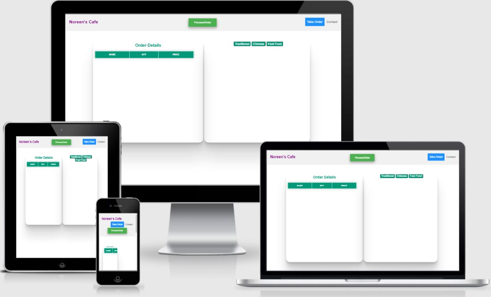
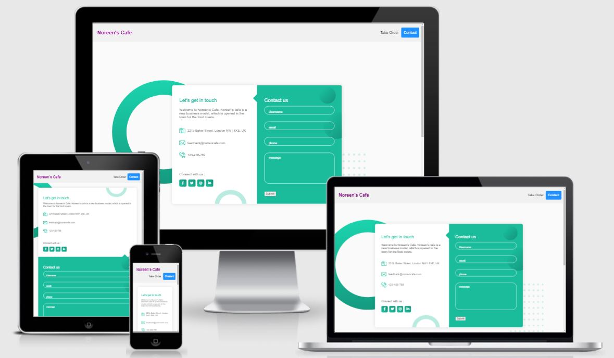

# Noreen-s-Cafe OrderManagement
## Introduction

The live link can be found here - (https://noreen-wb.github.io/noreenordertakingsystem/index.html)

Welcome to Noreen's Cafe. Noreen's cafe is a new business model, which is opened in the town for the food lovers. It's purpose is to give people Quality food and taste. We have the world's best chef in our Cafe. Who have traveled around the world and are very professional with their work. Noreen's cafe is very neat and clean and is very higenic place. We took care of our customer very well, before serving meal we disinfect all the  crokery so that there won't be any fungus or virus. Our head Chef is very intellegent and smart. He is responsible to maintain the enviroment of the kitchen and Dinein Happy and lively.

We have complete order management system. We have paper less enviroment. Waiter's in my cafe use tablets to take order. Reciept is generated when an order is placed. One reciept is goes to kitchen and one reciept is given to customer.
amireponsiveContact

## Table of Contents 

# Table of Contents
 [1. User Expereince (UX) design](#ux)
  - [User Expectations:](#user-expectations)
  -	[Colour scheme and font](#color-scheme)
  - [Site skeleton (wireframes)-2 pages](#wireframes)
    - [Home page](#home-page)
    - [Contact page](#contact-page)

 [2. Features](#features)

 [3.Technologies used](#technologies-used)

 [4.Testing](#testing)

 [5.Bugs](#bugs)

 [6. Deployment](#deployment)

 [7. Acknowledgement](#acknowledgement)